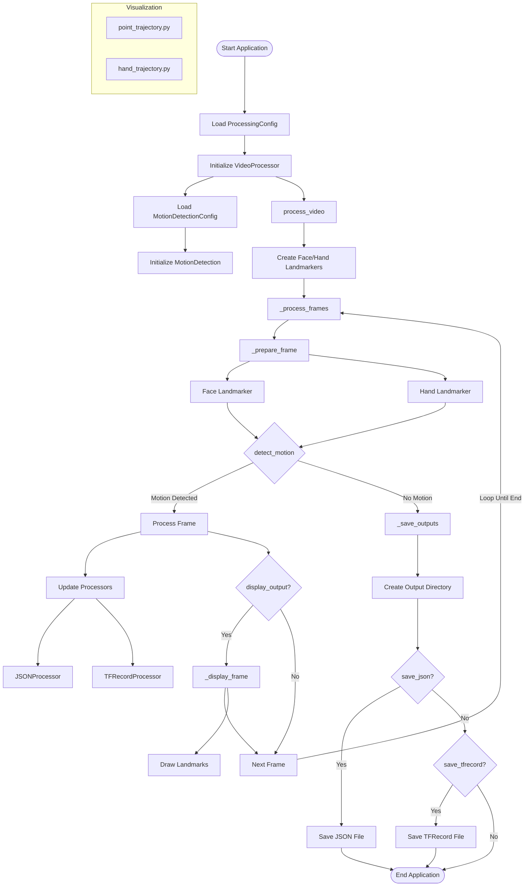

```mermaid
flowchart TD
    %% Main Program Flow
    Start([Start Application]) --> Config[Load ProcessingConfig]
    Config --> VideoProcessor[Initialize VideoProcessor]
    VideoProcessor --> MotionConfig[Load MotionDetectionConfig]
    MotionConfig --> MotionDetector[Initialize MotionDetection]

    %% Video Processing Flow
    VideoProcessor --> ProcessVideo[process_video]
    ProcessVideo --> LandmarkerFactory[Create Face/Hand Landmarkers]
    LandmarkerFactory --> ProcessFrames[_process_frames]

    %% Frame Processing Loop
    ProcessFrames --> PrepareFrame[_prepare_frame]
    PrepareFrame --> DetectFace[Face Landmarker]
    PrepareFrame --> DetectHands[Hand Landmarker]
    DetectFace --> MotionDetection{detect_motion}
    DetectHands --> MotionDetection

    %% Motion Detection
    MotionDetection -->|Motion Detected| ProcessFrame[Process Frame]
    MotionDetection -->|No Motion| SaveOutputs[_save_outputs]

    %% Process Frames
    ProcessFrame --> DataProcessors[Update Processors]
    DataProcessors --> JSONProcessor[JSONProcessor]
    DataProcessors --> TFRecordProcessor[TFRecordProcessor]

    %% Display Output
    ProcessFrame --> DisplayCheck{display_output?}
    DisplayCheck -->|Yes| DisplayFrame[_display_frame]
    DisplayCheck -->|No| NextFrame[Next Frame]
    DisplayFrame --> NextFrame

    %% Save Output
    SaveOutputs --> CreateOutputDir[Create Output Directory]
    CreateOutputDir --> SaveJSON{save_json?}
    SaveJSON -->|Yes| SaveJSONFile[Save JSON File]
    SaveJSON -->|No| SaveTFRecord{save_tfrecord?}
    SaveTFRecord -->|Yes| SaveTFRecordFile[Save TFRecord File]
    SaveTFRecord -->|No| Done
    SaveJSONFile --> Done
    SaveTFRecordFile --> Done

    %% Display Components
    DisplayFrame --> LandmarkDrawer[Draw Landmarks]

    %% Visualization Components
    subgraph Visualization
        PointTrajectory[point_trajectory.py]
        HandTrajectory[hand_trajectory.py]
    end

    %% End
    NextFrame -->|Loop Until End| ProcessFrames
    Done([End Application])
```
