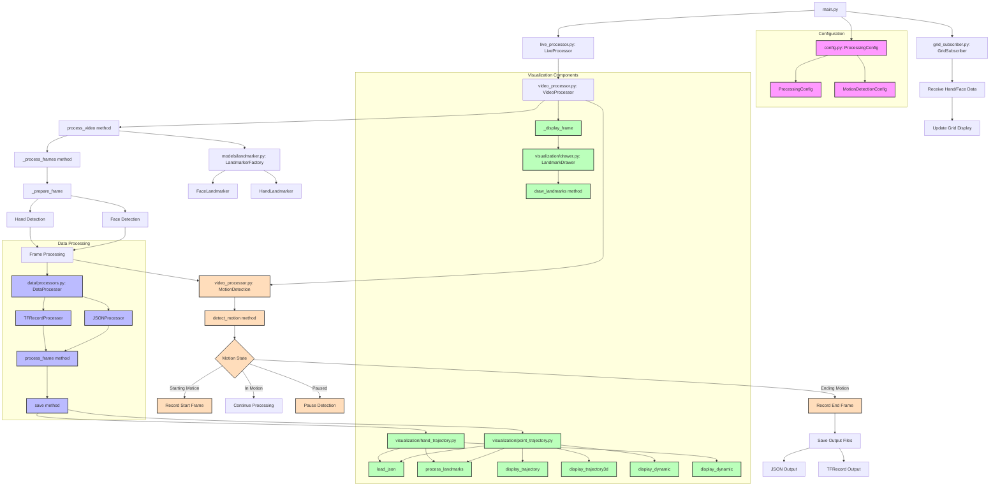

```mermaid
flowchart TD
    %% Main Entry Point
    Main[main.py] --> Config[config.py: ProcessingConfig]
    Main --> GridSub[grid_subscriber.py: GridSubscriber]
    Main --> LiveProc[live_processor.py: LiveProcessor]

    %% Configuration
    subgraph "Configuration"
        Config --> ProcConfig[ProcessingConfig]
        Config --> MotionConfig[MotionDetectionConfig]
    end

    %% Video Processing
    LiveProc --> VideoProc[video_processor.py: VideoProcessor]
    VideoProc --> ProcessVideo[process_video method]
    VideoProc --> MotionDetect[video_processor.py: MotionDetection]

    %% Core Processing Pipeline
    ProcessVideo --> Landmarker[models/landmarker.py: LandmarkerFactory]
    Landmarker --> FaceLandmark[FaceLandmarker]
    Landmarker --> HandLandmark[HandLandmarker]
    ProcessVideo --> ProcessFrames[_process_frames method]

    %% Frame Processing
    ProcessFrames --> PrepareFrame[_prepare_frame]
    PrepareFrame --> DetectFace[Face Detection]
    PrepareFrame --> DetectHands[Hand Detection]
    DetectFace --> FrameProcess[Frame Processing]
    DetectHands --> FrameProcess

    %% Motion Detection Pipeline
    FrameProcess --> MotionDetect
    MotionDetect --> DetectMotion[detect_motion method]
    DetectMotion --> MotionState{Motion State}
    MotionState -->|Starting Motion| StartFrame[Record Start Frame]
    MotionState -->|Ending Motion| EndFrame[Record End Frame]
    MotionState -->|In Motion| ContinueProc[Continue Processing]
    MotionState -->|Paused| PauseDetect[Pause Detection]

    %% Data Processing
    subgraph "Data Processing"
        FrameProcess --> DataProc[data/processors.py: DataProcessor]
        DataProc --> JsonProc[JSONProcessor]
        DataProc --> TFRProc[TFRecordProcessor]
        JsonProc --> ProcessFrame[process_frame method]
        TFRProc --> ProcessFrame
        ProcessFrame --> SaveData[save method]
    end

    %% Visualization
    subgraph "Visualization Components"
        VideoProc --> DisplayFrame[_display_frame]
        DisplayFrame --> Drawer[visualization/drawer.py: LandmarkDrawer]
        Drawer --> DrawLandmarks[draw_landmarks method]

        SaveData --> PointTraj[visualization/point_trajectory.py]
        SaveData --> HandTraj[visualization/hand_trajectory.py]

        PointTraj --> LoadJSON[load_json]
        HandTraj --> LoadJSON

        PointTraj --> ProcessLandmarks[process_landmarks]
        HandTraj --> ProcessLandmarks

        PointTraj --> PT_Display2D[display_trajectory]
        PointTraj --> PT_Display3D[display_trajectory3d]
        PointTraj --> PT_Dynamic[display_dynamic]

        HandTraj --> HT_Dynamic[display_dynamic]
    end

    %% Output Generation
    EndFrame --> SaveOutput[Save Output Files]
    SaveOutput --> OutputJson[JSON Output]
    SaveOutput --> OutputTFR[TFRecord Output]

    %% GridSubscriber Flow
    GridSub --> ReceiveData[Receive Hand/Face Data]
    ReceiveData --> UpdateGrid[Update Grid Display]

    %% Styling
    classDef configNode fill:#f9f,stroke:#333,stroke-width:2px
    classDef processorNode fill:#bbf,stroke:#333,stroke-width:2px
    classDef visualNode fill:#bfb,stroke:#333,stroke-width:2px
    classDef motionNode fill:#fdb,stroke:#333,stroke-width:2px

    class Config,ProcConfig,MotionConfig configNode
    class JsonProc,TFRProc,DataProc,ProcessFrame,SaveData processorNode
    class DisplayFrame,Drawer,DrawLandmarks,PointTraj,HandTraj,PT_Display2D,PT_Display3D,PT_Dynamic,HT_Dynamic,LoadJSON,ProcessLandmarks visualNode
    class MotionDetect,DetectMotion,MotionState,StartFrame,EndFrame,PauseDetect motionNode
```
